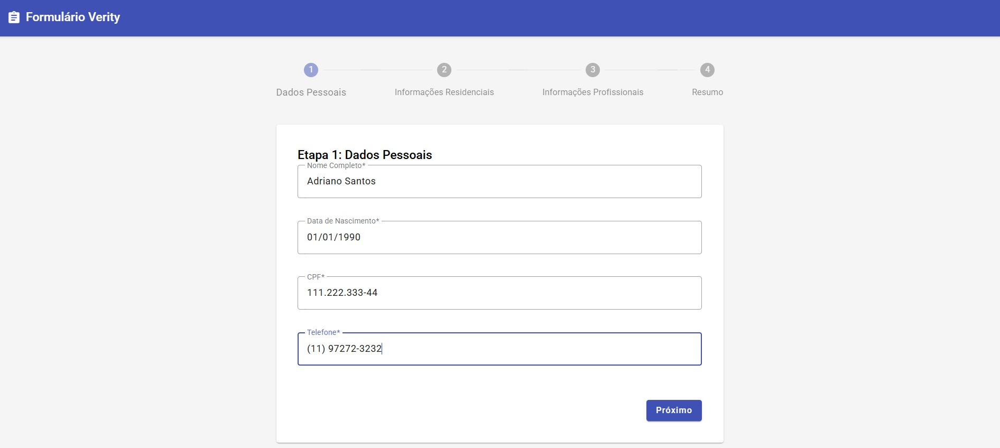
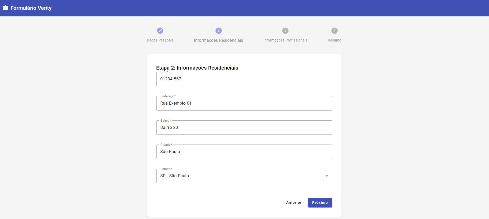
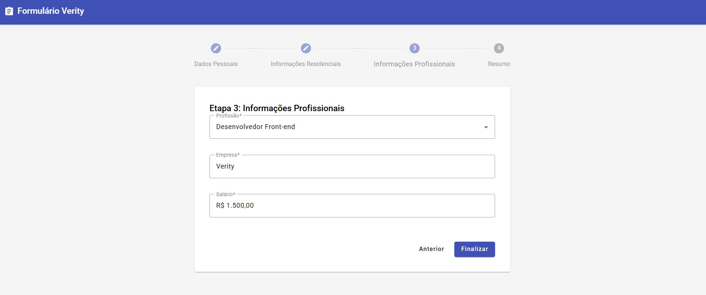
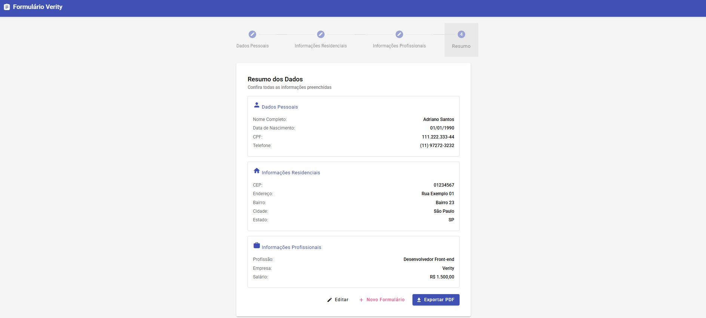
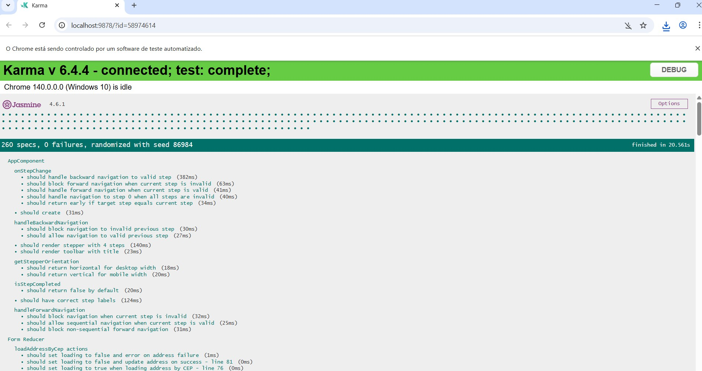
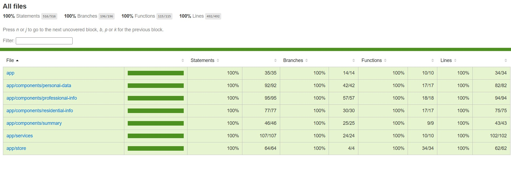
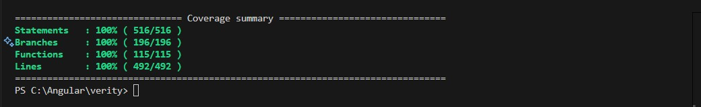
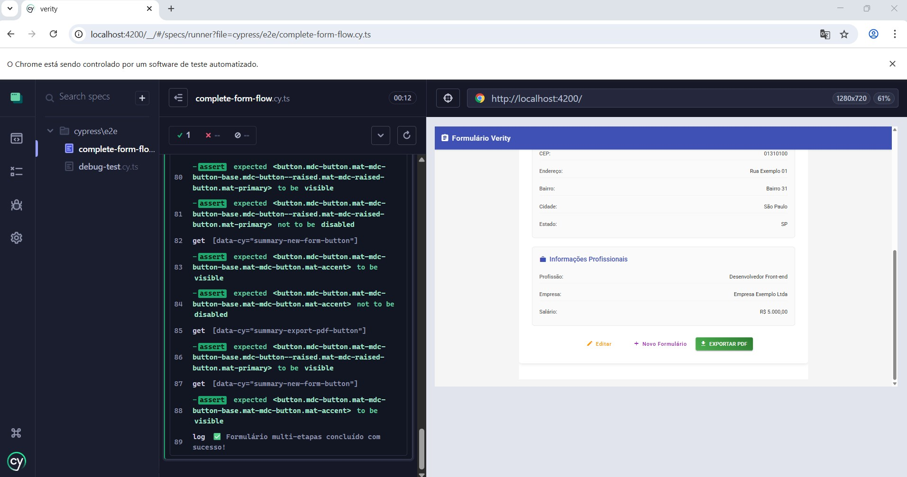
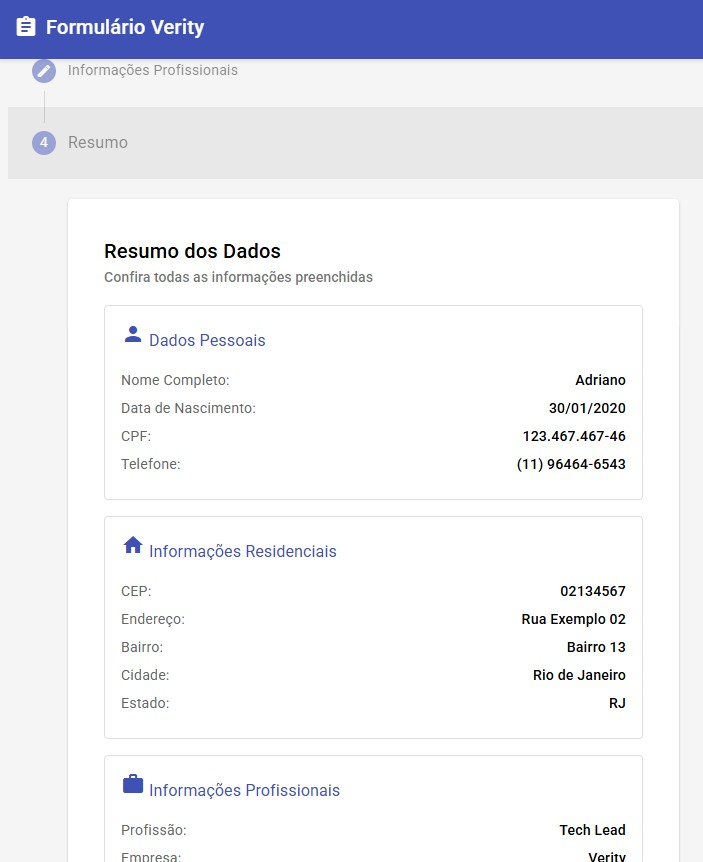

# Verity App - Formulário Multi-etapas

Uma aplicação Angular 20 moderna com formulário dividido em 3 etapas, utilizando Angular Material, NgRx para gerenciamento de estado e recursos de acessibilidade.

## 🚀 Funcionalidades

### ✨ Características Principais
- **Formulário Multi-etapas**: 3 etapas bem estruturadas
- **Angular Material**: Interface moderna e responsiva
- **NgRx**: Gerenciamento de estado centralizado
- **Acessibilidade**: Totalmente acessível com ARIA labels
- **Máscaras de Input**: Validações e formatação automática
- **Busca de CEP**: Preenchimento automático de endereço
- **Exportação PDF**: Geração de relatório completo

### 📋 Etapas do Formulário

#### Etapa 1: Dados Pessoais
- Nome completo (validação de mínimo 3 caracteres)
- Data de nascimento (máscara dd/mm/aaaa)
- CPF (máscara 000.000.000-00)
- Telefone (máscara (00) 00000-0000)

#### Etapa 2: Informações Residenciais
- CEP com busca automática
- Endereço (preenchido automaticamente)
- Bairro (preenchido automaticamente)
- Cidade (preenchida automaticamente)
- Estado (preenchido automaticamente)

#### Etapa 3: Informações Profissionais
- Profissão (select com opções da API mockada)
- Empresa
- Salário (máscara monetária R$ 0.000,00)

#### Resumo Final
- Visualização de todos os dados
- Opção de edição
- Exportação para PDF
- Criação de novo formulário

## 🛠️ Tecnologias Utilizadas

### 🎯 Core Framework
- **Angular 20**: Framework principal com sintaxe de controle moderna (`@if`, `@for`)
- **Angular Material**: Componentes de UI responsivos e acessíveis
- **NgRx**: Gerenciamento de estado (Store, Effects, Selectors)
- **RxJS**: Programação reativa e operadores assíncronos
- **TypeScript**: Linguagem de programação com tipagem forte

### 🎨 Interface e UX
- **SCSS**: Pré-processador CSS com variáveis e mixins
- **ngx-mask**: Máscaras de input para formatação automática
- **Flexbox/Grid**: Layout responsivo e moderno

### 📄 Funcionalidades Avançadas
- **jsPDF**: Geração de PDF com formatação profissional
- **HTML2Canvas**: Captura de elementos DOM para PDF

### 🧪 Qualidade e Testes
- **Karma**: Test runner para testes unitários
- **Jasmine**: Framework de testes com sintaxe BDD
- **Cypress**: Framework E2E para testes de interface
- **Angular Testing Library**: Utilitários modernos de teste
- **ESLint**: Análise estática de código e boas práticas

## 📦 Instalação

```bash
# Instalar dependências
npm install

# Executar em modo desenvolvimento
npm start

# Build para produção
npm run build

# Executar testes
npm test

# Executar linting
npm run lint
```

## 🎯 Arquitetura

### Estrutura de Pastas
```
src/
├── app/
│   ├── components/                    # Componentes da aplicação
│   │   ├── personal-data/             # Etapa 1: Dados pessoais
│   │   │   ├── personal-data.component.ts     # Lógica do componente
│   │   │   ├── personal-data.component.html   # Template HTML separado
│   │   │   ├── personal-data.component.css    # Estilos CSS separados
│   │   │   └── personal-data.component.spec.ts # Testes unitários
│   │   ├── residential-info/          # Etapa 2: Info residenciais
│   │   │   ├── residential-info.component.ts   # Lógica do componente
│   │   │   ├── residential-info.component.html # Template HTML separado
│   │   │   ├── residential-info.component.css  # Estilos CSS separados
│   │   │   └── residential-info.component.spec.ts # Testes unitários
│   │   ├── professional-info/         # Etapa 3: Info profissionais
│   │   │   ├── professional-info.component.ts  # Lógica do componente
│   │   │   ├── professional-info.component.html# Template HTML separado
│   │   │   ├── professional-info.component.css # Estilos CSS separados
│   │   │   └── professional-info.component.spec.ts # Testes unitários
│   │   └── summary/                   # Resumo final
│   │       ├── summary.component.ts         # Lógica do componente
│   │       ├── summary.component.html       # Template HTML separado
│   │       ├── summary.component.css        # Estilos CSS separados
│   │       └── summary.component.spec.ts    # Testes unitários
│   ├── models/                        # Interfaces e tipos
│   │   └── form-data.interface.ts     # Interface dos dados do formulário
│   ├── services/                      # Serviços da aplicação
│   │   ├── cep.service.ts             # Serviço de busca por CEP
│   │   ├── cep.service.spec.ts        # Testes do serviço CEP
│   │   ├── profession.service.ts      # Serviço de profissões
│   │   ├── profession.service.spec.ts # Testes do serviço Profissões
│   │   ├── pdf.service.ts             # Serviço de geração PDF
│   │   └── pdf.service.spec.ts        # Testes do serviço PDF
│   ├── store/                         # Estado NgRx
│   │   ├── form.actions.ts            # Ações do formulário
│   │   ├── form.effects.ts            # Effects para APIs
│   │   ├── form.effects.spec.ts       # Testes dos effects
│   │   ├── form.reducer.ts            # Reducer principal
│   │   ├── form.reducer.spec.ts       # Testes do reducer
│   │   ├── form.selectors.ts          # Seletores de estado
│   │   └── form.selectors.spec.ts     # Testes dos seletores
│   ├── app.component.ts               # Componente raiz (lógica)
│   ├── app.component.html             # Template principal separado
│   ├── app.component.css              # Estilos principais separados
│   ├── app.component.spec.ts          # Testes do componente principal
│   ├── app.config.ts                  # Configuração da app
│   └── main.ts                        # Bootstrap da aplicação
├── styles.scss                        # Estilos globais
├── index.html                         # HTML principal
├── cypress/                           # Testes E2E Cypress
│   ├── e2e/                          # Cenários de teste
│   │   ├── form-navigation.cy.ts     # Testes de navegação
│   │   ├── form-validation.cy.ts     # Testes de validação
│   │   └── complete-workflow.cy.ts   # Testes de fluxo completo
│   ├── fixtures/                     # Dados mockados para testes
│   └── support/                      # Utilitários e comandos customizados
├── docs/                             # Documentação e screenshots
│   ├── step1.jpg                     # Screenshot etapa 1
│   ├── step2.jpg                     # Screenshot etapa 2
│   ├── step3.jpg                     # Screenshot etapa 3
│   ├── step4.jpg                     # Screenshot resumo
│   ├── step5.jpg                     # Screenshot PDF
│   ├── karma.jpg                     # Screenshot testes Karma
│   ├── coverage.jpg                  # Screenshot cobertura
│   ├── ngtest.jpg                    # Screenshot ng test
│   └── responsivo.jpg                # Screenshot responsividade
└── README.md                         # Documentação do projeto
```

## ✨ Melhorias de Arquitetura

### 🎯 Separação de Responsabilidades
- **Templates HTML Separados**: Todos os componentes utilizam `templateUrl` com arquivos `.html` dedicados
- **Estilos CSS Organizados**: Cada componente possui seu próprio arquivo `.css` com `styleUrl`
- **Sintaxe de Controle Moderna**: Utilização da nova sintaxe `@if` e `@for` do Angular ao invés de `*ngIf` e `*ngFor`
- **Testes Modernos**: Migração completa para padrões de teste atuais sem dependências depreciadas

### 🧪 Cobertura de Testes Completa
- **Testes Unitários**: Cobertura completa com Karma/Jasmine
- **Testes E2E**: Framework Cypress com cenários abrangentes
- **Seletores de Teste**: Atributos `data-cy` em todos os elementos para testes confiáveis
- **Padrões Modernos**: Uso de `provideHttpClient()` e `provideNoopAnimations()` nas configurações

### 🚀 Benefícios da Arquitetura Atual
- **Manutenibilidade**: Código mais organizado e fácil de manter
- **Escalabilidade**: Estrutura preparada para crescimento do projeto
- **Performance**: Sintaxe otimizada e bundles menores
- **Qualidade**: Testes abrangentes garantem confiabilidade
- **Futuro-proof**: Uso das práticas mais atuais do Angular

## 🔧 Serviços Mockados

### Serviço de CEP
Simula uma API de busca por CEP que retorna:
- Endereço baseado no CEP
- Bairro, cidade e estado correspondentes
- Delay realista de resposta

#### Exemplos de CEPs por Estado:
- **CEPs iniciados com 01**: São Paulo (SP)
  - Exemplo: `01310-100` → Av. Paulista, Bela Vista, São Paulo
- **CEPs iniciados com 02**: Rio de Janeiro (RJ)
  - Exemplo: `02451-000` → Rua das Laranjeiras, Laranjeiras, Rio de Janeiro
- **CEPs iniciados com 03**: Minas Gerais (MG)
  - Exemplo: `03134-000` → Rua da Bahia, Centro, Belo Horizonte
- **CEPs iniciados com 04**: Espírito Santo (ES)
  - Exemplo: `04567-000` → Av. Vitória, Praia do Canto, Vitória
- **CEPs iniciados com 05**: Bahia (BA)
  - Exemplo: `05678-000` → Rua do Pelourinho, Centro Histórico, Salvador
- **CEPs iniciados com 06**: Paraná (PR)
  - Exemplo: `06789-000` → Rua XV de Novembro, Centro, Curitiba
- **CEPs iniciados com 07**: Ceará (CE)
  - Exemplo: `07890-000` → Av. Beira Mar, Meireles, Fortaleza
- **CEPs iniciados com 08**: Pernambuco (PE)
  - Exemplo: `08901-000` → Rua do Bom Jesus, Recife Antigo, Recife

> **Nota**: O serviço mockado reconhece qualquer CEP válido e retorna endereços fictícios baseados no padrão do estado correspondente.

### Serviço de Profissões
Mock com lista de profissões incluindo:
- Desenvolvedor de Software
- Analista de Sistemas  
- Gerente de Projetos
- Designer UX/UI
- Analista de Dados
- Arquiteto de Software
- DevOps Engineer
- Product Manager

## ♿ Acessibilidade

- **ARIA Labels**: Todos os campos possuem labels descritivos
- **Navegação por teclado**: Totalmente navegável via teclado
- **Screen readers**: Compatível com leitores de tela
- **Contrast ratios**: Cores com contraste adequado
- **Focus indicators**: Indicadores visuais de foco
- **Error announcements**: Anúncio de erros para usuários com deficiência visual

## 📱 Responsividade

- **Mobile First**: Design otimizado para dispositivos móveis
- **Breakpoints**: Adaptação para tablets e desktops
- **Stepper responsivo**: Orientação vertical em telas pequenas
- **Botões adaptáveis**: Layout flexível em diferentes telas

## 🔒 Validações

### Validações Implementadas
- **Nome**: Mínimo 3 caracteres
- **Data**: Formato dd/mm/aaaa válido
- **CPF**: Formato 000.000.000-00
- **Telefone**: Formato (00) 00000-0000
- **CEP**: Formato 00000-000
- **Campos obrigatórios**: Validação em todos os campos
- **Salário**: Valor maior que zero

## 📄 Exportação PDF

O sistema gera um PDF completo com:
- Cabeçalho personalizado
- Dados organizados por seções
- Formatação profissional
- Valores monetários formatados em Real (R$)

## Screenshots

Etapa 1 do formulário:

<p align="center">
  
</p>

Etapa 2 do formulário:

<p align="center">
  
</p>

Etapa 3 do formulário:

<p align="center">
  
</p>

Resumo do formulário:

<p align="center">
  
</p>

Exportação PDF:

<p align="center">
  
</p>

Test Karma | Jasmine | Front-End:

<p align="center">
  
</p>

<p align="center">
  
</p>

<p align="center">
  
</p>

Cypress

<p align="center">
  
</p>

Responsividade para se adaptar a diferentes layouts de tela:

<p align="center">
  
</p>

## 🚧 Roadmap de Funcionalidades

### ✅ Implementado
- [x] **Testes E2E Completos**: Framework Cypress com cobertura abrangente
- [x] **Testes Unitários**: Cobertura completa com Karma/Jasmine
- [x] **Arquitetura Moderna**: Templates e estilos separados
- [x] **Sintaxe Atual**: Migração para `@if` e `@for`
- [x] **Qualidade de Código**: ESLint e padrões modernos
- [x] **Acessibilidade**: ARIA labels e navegação por teclado
- [x] **Responsividade**: Design mobile-first

### 🎯 Próximas Funcionalidades
- [ ] **API Real de CEP**: Integração com ViaCEP ou similar
- [ ] **Validação CPF Avançada**: Algoritmo de validação real
- [ ] **Backend Integration**: Salvamento em banco de dados
- [ ] **Histórico**: Sistema de histórico de formulários preenchidos
- [ ] **Temas**: Sistema de temas dark/light personalizáveis
- [ ] **i18n**: Internacionalização PT-BR/EN
- [ ] **PWA**: Progressive Web App com offline support
- [ ] **Analytics**: Integração com Google Analytics
- [ ] **Performance**: Lazy loading e otimizações avançadas

## 📋 Scripts Disponíveis

```json
{
  "start": "ng serve",                    // Servidor de desenvolvimento
  "build": "ng build",                    // Build de produção
  "build:prod": "ng build --prod",        // Build otimizado
  "test": "ng test",                      // Testes unitários (Karma/Jasmine)
  "test:coverage": "ng test --code-coverage", // Testes com cobertura
  "cypress:open": "cypress open",         // Interface do Cypress
  "cypress:run": "cypress run",           // Executar testes E2E
  "e2e": "ng e2e",                       // Testes E2E integrados
  "lint": "ng lint",                      // Análise de código
  "serve:prod": "ng serve --prod"         // Servidor com build de produção
}
```

### 🎯 Comandos Úteis de Desenvolvimento

```bash
# Desenvolvimento com hot-reload
npm start

# Executar todos os testes unitários
npm test

# Executar testes com relatório de cobertura
npm run test:coverage

# Abrir interface interativa do Cypress
npm run cypress:open

# Executar todos os testes E2E
npm run cypress:run

# Build otimizado para produção
npm run build:prod

# Verificar qualidade do código
npm run lint
```

## 🤝 Contribuição

1. Fork o projeto
2. Crie uma branch para sua feature (`git checkout -b feature/verity`)
3. Commit suas mudanças (`git commit -m 'Add some verity'`)
4. Push para a branch (`git push origin feature/verity`)
5. Abra um Pull Request


## 👨‍💻 Autor

Desenvolvido por Adriano Vieira, usando Angular e as melhores práticas de desenvolvimento frontend.